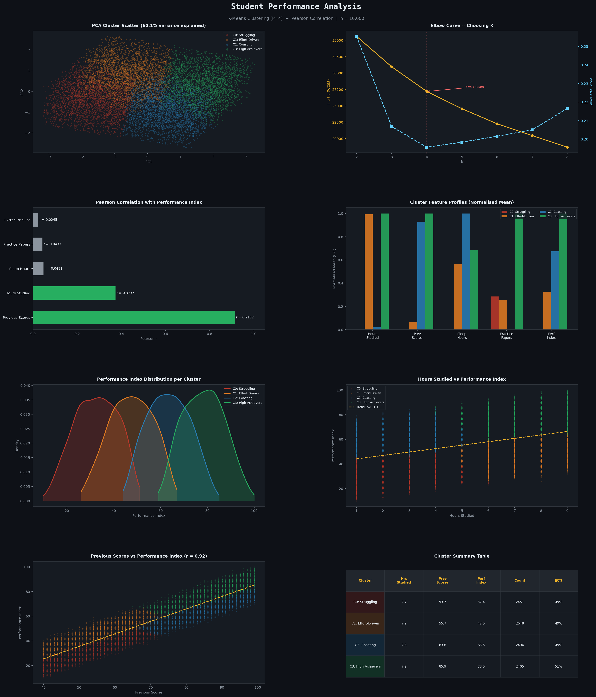

# Student Performance Analysis

Unsupervised machine learning analysis of 10,000 anonymised student records. Uses K-Means clustering to identify four distinct learning profiles and Pearson correlation to quantify which factors actually drive academic performance. Findings are framed as actionable curriculum recommendations.



---

## Dataset

| Column | Type | Range |
|---|---|---|
| Hours Studied | int | 1 - 9 |
| Previous Scores | int | 40 - 99 |
| Extracurricular Activities | str | Yes / No |
| Sleep Hours | int | 4 - 9 |
| Sample Question Papers Practiced | int | 0 - 9 |
| Performance Index | float | 10 - 100 |

10,000 rows, no missing values.

---

## Method

### Feature Engineering
`Extracurricular Activities` is encoded as a binary integer (1 = Yes, 0 = No) since K-Means requires numeric input.

### Scaling
All features are standardised with `StandardScaler` before clustering. K-Means is distance-based: without scaling, `Previous Scores` (range ~60) would dominate over `Sleep Hours` (range ~5) purely due to magnitude.

### Choosing k
Inertia (elbow curve) and silhouette score are computed for k = 2 to 8. Silhouette scores are modest across all k values, which is expected for a continuous dataset without hard-edged natural clusters. k = 4 is selected because it produces four profiles that are interpretable and map cleanly onto pedagogically meaningful student types.

### Clustering
`KMeans(n_clusters=4, n_init=10, random_state=42)` from scikit-learn. Clusters are relabelled in ascending order of mean Performance Index after fitting.

### Correlation
Pearson r computed between each feature and the Performance Index. With n = 10,000, all p-values are effectively zero, so effect magnitude is the relevant metric.

### Visualisation
PCA reduces the 5-dimensional scaled space to 2 components (60.1% variance retained) for scatter plotting. All other charts use original-scale values.

---

## Results

### Cluster Profiles

| Cluster | Profile | Hrs Studied | Prev Scores | Perf Index | n |
|---|---|---|---|---|---|
| 0 | Struggling | 2.7 | 53.7 | 32.4 | 2451 |
| 1 | Effort-Driven | 7.2 | 55.7 | 47.5 | 2648 |
| 2 | Coasting | 2.8 | 83.6 | 63.5 | 2496 |
| 3 | High Achievers | 7.2 | 85.9 | 78.5 | 2405 |

Sleep hours are nearly identical across all clusters (6.4 to 6.6h). Extracurricular participation is uniform at 49-51% in every group.

### Correlations with Performance Index

| Feature | Pearson r | Interpretation |
|---|---|---|
| Previous Scores | +0.9152 | Dominant predictor |
| Hours Studied | +0.3737 | Moderate positive effect |
| Sleep Hours | +0.0481 | Negligible |
| Practice Papers | +0.0433 | Negligible |
| Extracurricular | +0.0245 | Negligible |

### Key Finding

Previous Scores accounts for nearly all of the predictable variance in Performance Index (r = 0.92). Current performance is largely a continuation of where a student was before the course began. Hours Studied is the only meaningfully modifiable behavioural variable (r = 0.37).

---

## Curriculum Recommendations

**Cluster 0 -- Struggling**: Foundational remediation, not more work. Pre-semester diagnostics to map knowledge gaps. Peer tutoring and tracked micro-goals.

**Cluster 1 -- Effort-Driven**: Effort is already there. The problem is study quality, not quantity. Retrieval practice over re-reading. Targeted gap-filling from diagnostic pre-tests.

**Cluster 2 -- Coasting**: Prior knowledge is carrying them. Stretch assignments and enrichment tracks. Avoid placing in remedial groups.

**Cluster 3 -- High Achievers**: Both dimensions working. Advanced electives and independent research opportunities. Monitor for burnout.

---

## Setup

```bash
git clone https://github.com/sobanmujtaba/student-performance-analysis
cd student-performance-analysis

pip install -r requirements.txt

# place your CSV in the project root, then:
python analysis.py
```

Output: `student_performance_analysis-1.png` and `cluster_profiles.csv`

---

## Requirements

```
pandas>=1.5
numpy>=1.23
scikit-learn>=1.1
matplotlib>=3.6
scipy>=1.9
```

---

## Interactive Report

Open `index.html` in any browser for a standalone interactive version of the findings. No server required.

---

## Tech Stack

Python 3.10+, pandas, NumPy, scikit-learn, Matplotlib, SciPy

---

## License

MIT
